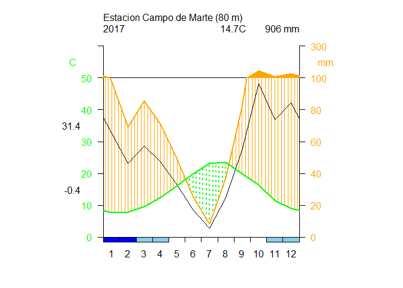
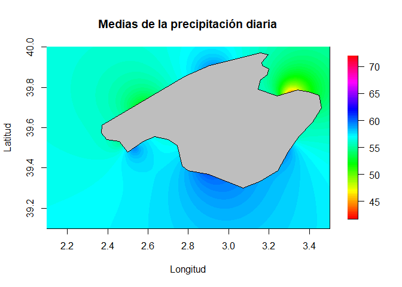

CLIMATOL
================
Álvarez Letona Manuel
30/1/2022

# EJERCICIOS DE CLIMATOL

## Nivel I

### 1.-Generar un diagrama de Walter y Lieth con la data de datcli, este debe llevar de título “Estación Campo de Marte”, a una altitud de 80 msnm durante el año 2017, con los meses simbolizados por números. Las temperaturas deberán visualizarse de color verde; las precipitaciones, en naranja; los meses de congelación segura, en azul y los de congelación probable, en celeste. No trazar una línea suplementaria de precipitación.

***Solucion***

``` r
data(datcli)
diagwl(datcli,"Estacion Campo de Marte",80,"2017",margen = c ( 4 ,  4 ,  4 ,  4 ),mlab="1-12",pcol="orange",tcol="green",pfcol="skyblue",
       sfcol="blue",shem=F,p3line=T)
```

<!-- -->

### 2.-Recrea minuciosamente el siguiente diagrama de la rosa de los vientos


***Solucion***

``` r
data(windfr) 
rosavent(windfr,fnum=6,fint=2, flab=1, ang=3*pi/8  ,col=rainbow(8), uni="km/s")
```

<!-- -->

## Nivel II

### 3.- Convertir la data diaria de tmax en una data de medias mensuales. Posteriormente, homogeneizar dichos datos mensuales con una normalización por estandarización y gráficos de medias anuales y correcciones aplicadas en el análisis exploratorio de datos (utilizar dos decimales).

***Solucion***

``` r
data(tmax) 
write.table(dat,"tmax_2001-2003.dat",row.names = F,col.names = F) 
write.table(est.c,"tmax_2001-2003.est",row.names = F,col.names = F)
dd2m("tmax",2001,2003,ndec = 2,valm = 2) 
```

    ##   1  2  3
    ## 
    ## Monthly mean values saved to file tmax-m_2001-2003.dat 
    ##   (Months with more than 10 missing original daily data
    ##   have also been set to missing)

``` r
read.table("tmax-m_2001-2003.dat",header = F)
```

    ##      V1    V2    V3    V4    V5    V6    V7    V8    V9   V10   V11   V12
    ## 1 15.00 16.01 13.92 15.53 17.53 18.53    NA 16.92 20.47 20.86 24.28    NA
    ## 2 23.67 23.85    NA 27.34 26.89 32.26 32.75 32.59 30.65 29.78 29.83 28.36
    ## 3 25.81 22.23 21.85 20.87 21.42 20.00 19.93 16.50 17.56 13.45 14.04 16.24
    ## 4 15.71 14.76 15.38 11.66 16.29 19.85 17.87 19.90 20.20 18.88 23.25 25.83
    ## 5 26.96 27.48 28.25 30.25 30.03 30.93 30.88 32.39 32.37 28.81 27.76 27.34
    ## 6 22.75 23.21 19.76 19.45 18.30 16.71    NA 16.90 15.98 15.08 15.88    NA
    ## 7 16.41 15.65    NA 19.16 18.55 18.54 20.80 19.09 18.52 23.40 22.96 25.34
    ## 8 29.09 26.34 29.65 31.13 31.45 34.15 33.57 34.06 34.26 31.84 30.03 25.22
    ## 9 25.09 23.61 21.56 22.70 21.01 20.74 19.72 18.84 15.63 15.13 13.23 14.76

### 4.- Recortar la data mensual de Ptest desde 1965 hasta 2005. Homogeneizar dicha data mediante clústers o áreas rectangulares, cNivel II on un ancho de superposición de 0, mediante una estandarización y con gráficos de totales anuales en el análisis exploratorio de datos. Mostrar las medias de las series homogeneizadas en un archivo Excel que, además, mencione los totales anuales y los datos de la latitud, longitud y nombre de cada estación (utilizar dos decimales).

***Solucion***

``` r
data(Ptest)
write.table(dat,"Ptest_1951-2010.dat",row.names=F,col.names=F)
write.table(est.c,"Ptest_1951-2010.est",row.names=F,col.names=F)
datsubset("Ptest",1951,2010,1965,2005,1)
```

    ## Subset data written to files Ptest_1965-2005.dat and Ptest_1965-2005.est

``` r
homogsplit("Ptest",1965,2005,2.9,39,xo=0,yo=0,std=3, gp=4,expl=T,nm=12)
```

    ## 
    ## HOMOGSPLIT() APPLICATION OUTPUT  (From R's contributed package 'climatol' 3.1.1)
    ## 
    ## =========== Homogenization of Ptest, 1965-2005. (Sun Jan 30 23:22:42 2022)
    ## 
    ## Parameters: varcli=Ptest anyi=1965 anyf=2005 xc=2.9 yc=39 xo=0 yo=0 maponly=FALSE suf=NA nm=12 nref=10,10,4 swa=NA std=3 ndec=1 dz.max=5 dz.min=-5 wd=0,0,100 snht1=25 snht2=25 tol=0.02 maxdif=NA mxdif=NA force=FALSE wz=0.001 trf=0 mndat=NA gp=4 ini=NA na.strings=NA maxite=999 vmin=NA vmax=NA nclust=100 grdcol=#666666 mapcol=#666666 hires=TRUE expl=TRUE metad=FALSE sufbrk=m tinc=NA tz=UTC cex=1.2 verb=TRUE x=NA
    ## 
    ## 
    ## ==================================================
    ## 
    ##               AREA  1 1 
    ## 
    ## ==================================================
    ## 
    ## No target stations in this area
    ## 
    ## ==================================================
    ## 
    ##               AREA  1 2 
    ## 
    ## ==================================================
    ## 
    ## No target stations in this area
    ## 
    ## ==================================================
    ## 
    ##               AREA  2 1 
    ## 
    ## ==================================================
    ## 
    ## Only 4 stations in this area:
    ## They will be included in the next selection.
    ## 
    ## ==================================================
    ## 
    ##               AREA  2 2 
    ## 
    ## ==================================================
    ## 
    ## 
    ## HOMOGEN() APPLICATION OUTPUT  (From R's contributed package 'climatol' 3.1.1)
    ## 
    ## =========== Homogenization of Ptest-1, 1965-2005. (Sun Jan 30 23:22:43 2022)
    ## 
    ## Parameters: varcli=Ptest-1 anyi=1965 anyf=2005 suf=NA nm=12 nref=10,10,4 std=3 swa=NA ndec=1 dz.max=5 dz.min=-5 wd=0,0,100 snht1=0 snht2=0 tol=0.02 maxdif=0.05 mxdif=0.05 maxite=999 force=FALSE wz=0.001 trf=0 mndat=NA gp=4 ini=NA na.strings=NA vmin=NA vmax=NA nclust=100 cutlev=NA grdcol=#666666 mapcol=#666666 hires=TRUE expl=TRUE metad=FALSE sufbrk=m tinc=NA tz=UTC cex=1.2 verb=TRUE
    ## 
    ## Data matrix: 492 data x 20 stations

    ## 
    ## -------------------------------------------
    ## Stations in the 3 clusters:
    ## 
    ## $`1`
    ##      Z Code        Name
    ## 1  183 S031 Station_031
    ## 2  125 S047 Station_047
    ## 8    1 S095 Station_095
    ## 11   6 S088 Station_088
    ## 17 120 S036 Station_036
    ## 18 155 S015 Station_015
    ## 
    ## $`2`
    ##      Z Code        Name
    ## 3  100 S098 Station_098
    ## 5   79 S081 Station_081
    ## 6   64 S069 Station_069
    ## 20  70 S100 Station_100
    ## 
    ## $`3`
    ##      Z Code        Name
    ## 4  129 S051 Station_051
    ## 7  865 S058 Station_058
    ## 9   38 S039 Station_039
    ## 10 107 S034 Station_034
    ## 12 160 S055 Station_055
    ## 13 160 S042 Station_042
    ## 14  20 S075 Station_075
    ## 15  89 S038 Station_038
    ## 16  27 S007 Station_007
    ## 19 265 S097 Station_097
    ## 
    ## ---------------------------------------------

    ## Computing inter-station distances:  1  2  3  4  5  6  7  8  9  10  11  12  13  14  15  16  17  18  19
    ## 
    ## 
    ## ========== STAGE 3 (Final computation of all missing data) ==========
    ## 
    ## Computing inter-station weights... (done)

    ## Computation of missing data with outlier removal
    ## (Suggested data replacements are provisional)
    ## 
    ## The following lines will have one of these formats:
    ##   Station(rank) Date: Observed -> Suggested (Anomaly, in std. devs.)
    ##   Iteration Max.data.difference (Station_code)
    ## 2 -19.047 (S047)
    ## 3 -4.048 (S047)
    ## 4 -0.923 (S047)
    ## 5 -0.242 (S047)
    ## 6 -0.068 (S047)
    ## 7 0.022 (S100)
    ## 
    ## Last series readjustment (please, be patient...)

    ## 
    ## ======== End of the missing data filling process, after 15.06 secs 
    ## 
    ## ----------- Final computations:
    ## 
    ## ACmx: Station maximum absolute autocorrelations of anomalies
    ##    Min. 1st Qu.  Median    Mean 3rd Qu.    Max.    NA's 
    ##  0.4100  0.5650  0.6100  0.6053  0.6550  0.7500       1 
    ## 
    ## SNHT: Standard normal homogeneity test (on anomaly series)
    ##    Min. 1st Qu.  Median    Mean 3rd Qu.    Max. 
    ##    8.20   14.28   23.60   33.12   33.12  136.50 
    ## 
    ## RMSE: Root mean squared error of the estimated data
    ##    Min. 1st Qu.  Median    Mean 3rd Qu.    Max. 
    ##   43.05   55.48   64.67   65.77   75.84   87.21 
    ## 
    ## POD: Percentage of original data
    ##    Min. 1st Qu.  Median    Mean 3rd Qu.    Max. 
    ##   43.00   53.00   59.00   58.35   63.00   72.00 
    ## 
    ##    ACmx SNHT  RMSE POD Code Name       
    ## 1    NA  14.3 74.5 43  S031 Station_031
    ## 2  0.71 136.5 87.1 49  S047 Station_047
    ## 3  0.54  14.2 45.6 53  S098 Station_098
    ## 4  0.63  21.2 80.7 58  S051 Station_051
    ## 5  0.63  24.9 69.4 54  S081 Station_081
    ## 6  0.65  10.1 58.7 57  S069 Station_069
    ## 7  0.63  23.7 62.2 60  S058 Station_058
    ## 8  0.73 113.4 87.1 59  S095 Station_095
    ## 9  0.46  37.1 49.5 63  S039 Station_039
    ## 10 0.57  50.1 61.3 67  S034 Station_034
    ## 11 0.56  31.8 79.7 69  S088 Station_088
    ## 12 0.61  15.2 62.4 59  S055 Station_055
    ## 13 0.75  48.2 70.8 60  S042 Station_042
    ## 14 0.61  25.5 73.3 63  S075 Station_075
    ## 15 0.41   8.2 49.0 72  S038 Station_038
    ## 16 0.47   8.9 43.1 68  S007 Station_007
    ## 17 0.66  11.4 57.5 59  S036 Station_036
    ## 18 0.61  26.5 87.2 53  S015 Station_015
    ## 19 0.57  23.5 49.4 53  S097 Station_097
    ## 20 0.70  17.6 67.0 48  S100 Station_100

    ## 
    ## ----------- Generated output files: -------------------------
    ## 
    ## Ptest-1_1965-2005.txt :  This text output 
    ## Ptest-1_1965-2005_out.csv :  List of corrected outliers 
    ## Ptest-1_1965-2005_brk.csv :  List of corrected breaks 
    ## Ptest-1_1965-2005.pdf :  Diagnostic graphics 
    ## Ptest-1_1965-2005.rda :  Homogenization results. Postprocess with (examples):
    ##    dahstat('Ptest-1',1965,2005) #get averages in file Ptest-1_1965-2005-me.csv 
    ##    dahstat('Ptest-1',1965,2005,stat='tnd') #get OLS trends and their p-values 
    ##    dahgrid('Ptest-1',1965,2005,grid=YOURGRID) #get homogenized grids 
    ##    ... (See other options in the package documentation)
    ## 
    ## 
    ## ======== End of homogenization of overlapping areas, after 15.48 secs 
    ## 
    ## ----------- Generated output files: -------------------------
    ## 
    ## Ptest_1965-2005.txt :  This text output
    ## Ptest_1965-2005_out.csv :  List of corrected outliers
    ## Ptest_1965-2005_brk.csv :  List of corrected breaks
    ## Ptest-*_1965-2005.pdf :  Diagnostic graphics (one file per area)
    ## Ptest_1965-2005-map.pdf :  Map of specified areas
    ## Ptest_1965-2005.rda :  Homogenization results. Postprocess with (examples):
    ##    dahstat('Ptest',1965,2005) #get averages in file Ptest_1965-2005-me.csv
    ##    dahstat('Ptest',1965,2005,stat='tnd') #get OLS trends and their p-values
    ##    dahgrid('Ptest',1965,2005,grid=YOURGRID) #get homogenized grids
    ##    ... (See other options in the package documentation)

``` r
dahstat("Ptest",1965,2005,stat="me",ndc=2,vala=1,estcol = c(1,2,5))
```

    ## Mean values of Ptest (1965-2005)
    ##   written to Ptest_1965-2005_me.csv

## Nivel III

### 5.- Con la data homogenizada del ejercicio anterior (si no se ha realizado, iniciar homogeneizando tal cual se menciona en el ejercicio 4) plotear un gráfico de calor con las medias de precipitación mensual de acuerdo con la latitud y longitud, este debe abarcar desde el punto 2.1°E 39.1°N hasta el punto 3.5°E 40°N, con una separación de 0.001 entre líneas. Además, debe tener un título principal y etiquetado en ambos ejes. Adicionalmente, plotear un mapa de la zona del mundo en cuestión encima de dicho gráfico (use col=rainbow(100)).

***Solucion***

``` r
save(dat,est.c,file="Pt_1965-2005.rda")
grillado<-expand.grid(x=seq(2.1,3.5,0.001),y=seq(39.1,40,0.001))
coordinates(grillado)<-~ x+y
dahgrid("Ptest", 1965, 2005, grid=grillado)
```

    ## Interpolating 492 grids...:        2 %  4 %  6 %  8 % 10 % 12 % 14 % 16 % 18 % 20 % 22 % 24 % 26 % 28 % 30 % 33 % 35 % 37 % 39 % 41 % 43 % 45 % 47 % 49 % 51 % 53 % 55 % 57 % 59 % 61 % 63 % 65 % 67 % 69 % 71 % 73 % 75 % 77 % 79 % 81 % 83 % 85 % 87 % 89 % 91 % 93 % 96 % 98 % 100 % (done)
    ## 
    ## Normalized grids (-1.034135 to 11.596063) saved to file Ptest_1965-2005.nc 
    ## Means and standard deviations (of the whole series) saved to files
    ## Ptest_1965-2005_m.nc, Ptest_1965-2005_s.nc and Ptest_1965-2005_msd.csv

``` r
ptest_grillado <- nc_open("C:/Users/evaristo/Desktop/Climatol/Ptest_1965-2005_m.nc")
print(ptest_grillado)
```

    ## File C:/Users/evaristo/Desktop/Climatol/Ptest_1965-2005_m.nc (NC_FORMAT_CLASSIC):
    ## 
    ##      1 variables (excluding dimension variables):
    ##         float Ptest.m[lon,lat]   
    ##             _FillValue: NaN
    ##             long_name: Ptest 1965-2005 means
    ## 
    ##      2 dimensions:
    ##         lon  Size:1401 
    ##             units: deg.E
    ##             long_name: lon
    ##         lat  Size:901 
    ##             units: deg.N
    ##             long_name: lat

``` r
ptest_var <- ncvar_get(ptest_grillado,"Ptest.m") 
ptest_lat <- ncvar_get(ptest_grillado,"lat")
ptest_lat <- rev(ptest_lat)
ptest_long <- ncvar_get(ptest_grillado,"lon")
dims_variable <- dim(ptest_var)
image.plot(ptest_long,ptest_lat,ptest_var[,length(ptest_lat):1], main = paste("Medias de la precipitación diaria"), xlab = "Longitud",ylab = "Latitud", col = rainbow(100))
map("world", add=T, fill=T, col="gray")
```

<!-- -->
